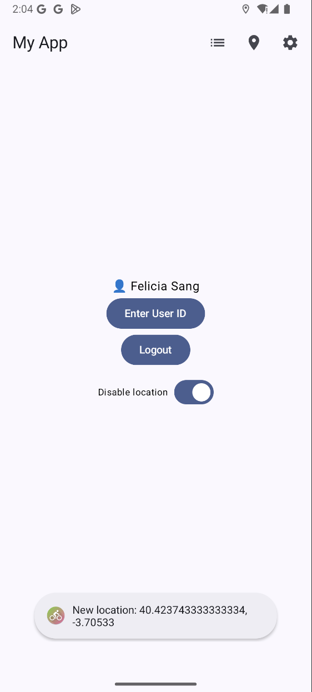
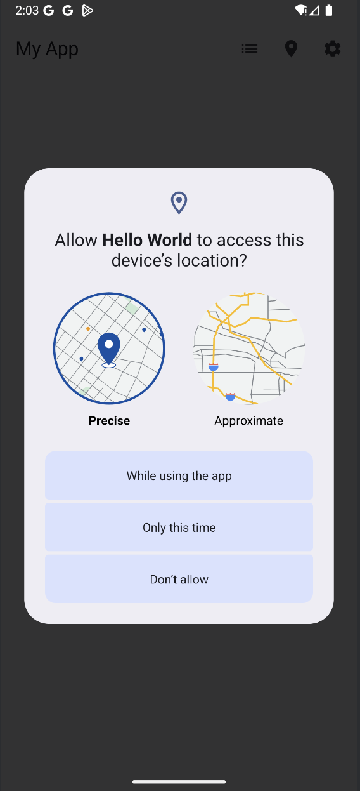
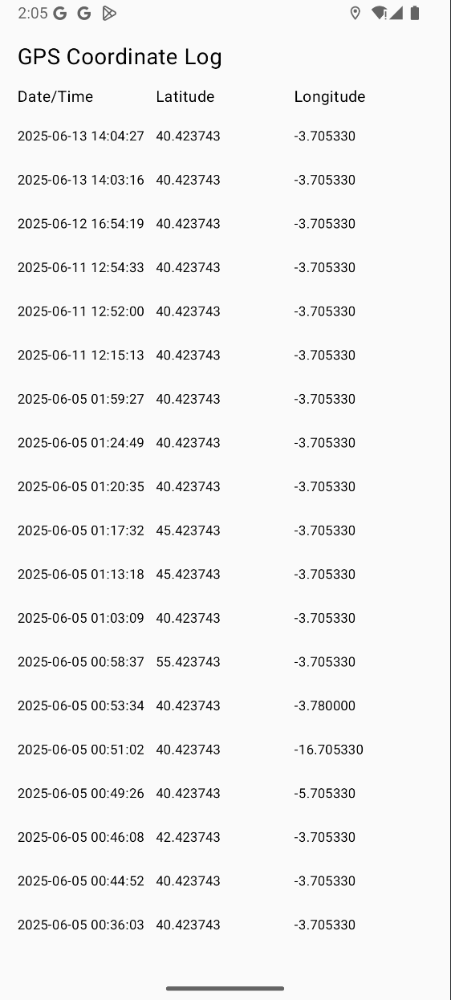
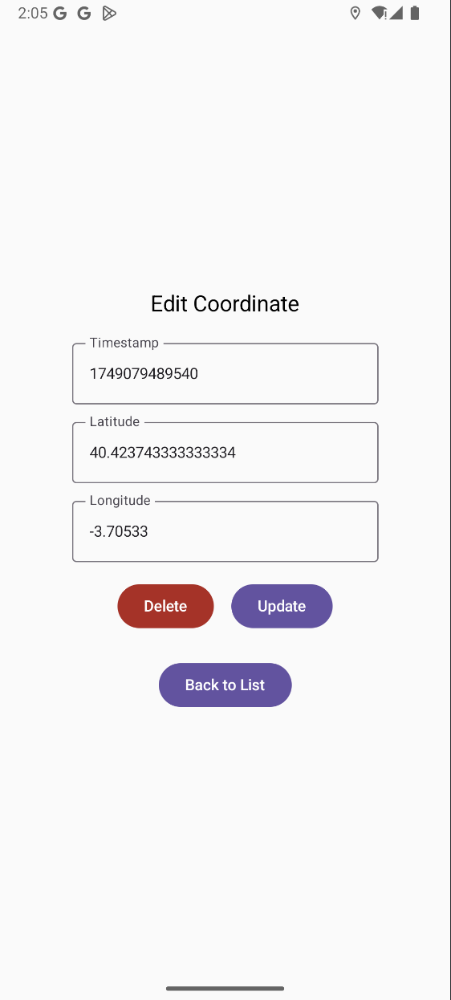
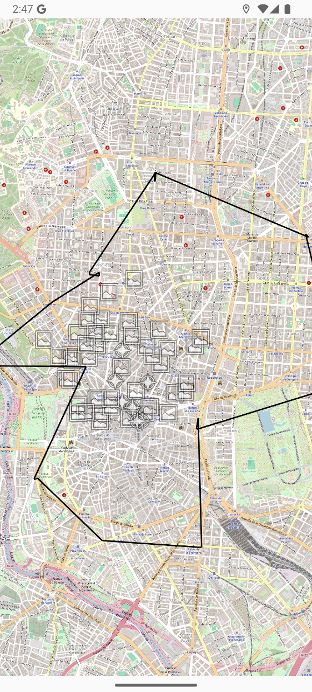
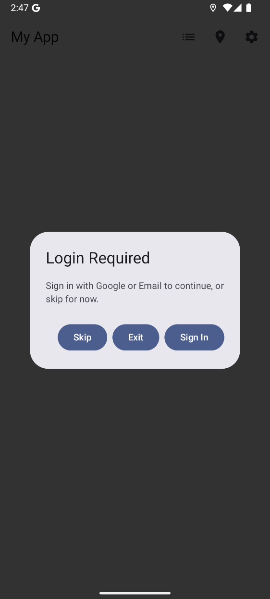
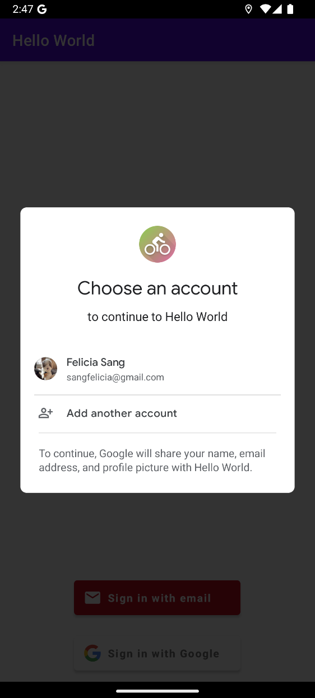

# HelloWorldMAD24

📱 Kotlin Android App for nature-based biking and location tracking

## GitHub and Workspace Links

- **Repository**: [GitHub](https://github.com/fsangupm/kotlinprojectMAD)
- **Releases**: [Releases](https://github.com/fsangupm/kotlinprojectMAD/releases)
- **Workspace**: [Sharepoint](https://upm365.sharepoint.com/sites/FeliciaSangMAD/SitePages/Tracking.aspx)

---

## Description

This mobile app supports users exploring outdoor environments through cycling. It records GPS coordinates, visualizes paths using OpenStreetMap, and fetches nearby scenic amenities such as drinking water spots, cycle parking, and landmarks. The app promotes sustainable commuting and recreational wellness.

Data is stored using a local Room database, while user preferences such as API keys and identifiers are stored using SharedPreferences. Firebase Authentication is used for user login.

---

## Screenshots and Navigation

---

## Demo Video

---

## Features

Functional Features:

- Track GPS location in real time.
- Visualize location data on OpenStreetMap.
- Display nearby POIs from Overpass API.
- Store and manage coordinates.
- Edit or delete data entries.
- Navigate between screens via top bar.

Technical Features:
- Persistence in CSV/text file
- Persistence in Room database, for storing coordinates
- Room database for storing coordinates.
- Maps: Openstreetmaps. Ref: Source code
- Resful APIs used: OpenStreetMap and Retrofit for Overpass API.
- Menu: Navigation Drawer. Ref: Source code
- Sensors: GPS coordinates.

---

## Main Screens and Features

- **MainActivity**: Entry point, top bar with navigation, Firebase login, user ID input.
- **SecondActivity**: Displays list of recorded GPS coordinates.
- **ThirdActivity**: View, update, and delete individual coordinate records.
- **SettingsActivity**: View stored preferences; includes navigation to Android settings.
- **OpenStreetMapsActivity**: Displays current location and scenic cycling routes with Overpass API integration.

---

## How to Use

When launching the app, users are directed to the main activity. To access all features, they can use the menu. The first step is to log in
using either an email or Google account. Once logged in, users can view the map or choose a location and the app will generate a bike route from nearby cycleways. 
The app will display nearby points of interests for bikers (cycle parking, landmarks, drinking water). The app periodically tracks the user's position. 
Users can also view or delete coordinates by clicking on them.

---

## Contributors

- **Felicia Sang** – `f.sang@alumnos.upm.es`

> Workload distribution: 100% (solo project)
